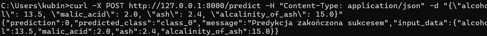

# Laboratorium 04 - Konteneryzacja modelu ML za pomocą Dockera

## Instrukcje uruchamiania aplikacji

### 1. Uruchomienie lokalnie (bez Dockera)
```bash
cd Lab04
pip install -r requirements.txt
uvicorn app:app --host 127.0.0.1 --port 8000 --reload
```

### 2. Uruchomienie za pomocą Dockera (Zadanie 2 i 3)
```bash
cd Lab04
docker build -t lab04-api .
docker run -d -p 8000:8000 --name lab04-container lab04-api
```

### 3. Uruchomienie za pomocą Docker Compose (Zadanie 4)
```bash
cd Lab04
docker-compose up -d
```

Aby zatrzymać i usunąc kontenery:
```bash
docker-compose down
```

## 4. Testowanie endpointu za pomocą cURL
Po uruchomieniu aplikacji:
```bash
curl -X POST [http://127.0.0.1:8000/predict](http://127.0.0.1:8000/predict) \
     -H "Content-Type: application/json" \
     -d "{\"alcohol\": 13.5, \"malic_acid\": 2.0, \"ash\": 2.4, \"alcalinity_of_ash\": 15.0}"
```

**Wynik:**
```javascript
{
  "prediction": 0,
  "predicted_class": "class_0",
  "message": "Predykcja zakończona sukcesem",
  "input_data": {
    "alcohol": 13.5,
    "malic_acid": 2,
    "ash": 2.4,
    "alcalinity_of_ash": 15
  }
}
```




### 5. Konfiguracja i wymagania sprzętowe

## Zmienne środowiskowe:

W pliku `docker-compose.yml` zdefiniowano następujące zmienne środowiskowe, aby skonfigurować parametry aplikacji:

* `ENVIRONMENT`: Określa tryb działania środowiska (np. `production` lub `development`).
* `MODEL_VERSION`: Wskazuje na aktualną wersję modelu uczenia maszynowego (np. `1.1.0`).

## Zasoby

Aplikacja opiera się na lekkim frameworku `FastAPI` i wykorzystuje prosty model z biblioteki `scikit-learn`.

* Pamięć RAM: 256-512 MB
* CPU: nie więcej niż jeden rdzeń (lub jego ułamek, np. 0.5 vCPU)
* Dysk: nie więcej niż 1 GB (głównie na pobranie obrazu Pythona i instalacja pakietów z `requirements.txt`)
