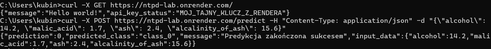

# Laboratorium 05 - Serverless deployment - chmura vs on-premise

## 1. Serverless vs własny serwer (Zadanie 4)

### Serverless (np. Render, Google Cloud Run)
* **Zalety:**
    * Deweloper może skupić się tylko na kodzie, nie na administracji systemem.
    * Automatyczne zwiększanie zasobów pod wpływem ruchu.
    * Model "pay-per-use" - płacimy tylko za faktyczny czas działania aplikacji.
* **Wady:**
    * Opóźnienie przy pierwszym uruchomieniu po okresie bezczynności. ("cold start")
    * Mniejsza kontrola nad konfiguracją niskopoziomową serwera.

### Własny Serwer (On-Premise)
* **Zalety:**
    * Możliwość dowolnej konfiguracji sprzętowej i programowej.
    * Brak problemu "cold start", stała dostępność zasobów.
* **Wady:**
    * Konieczność opłacania prądu, chłodzenia i sprzętu niezależnie od ruchu.
    * Wymaga ręcznego aktualizowania systemu i dbania o bezpieczeństwo.

---

## 2. Obsługa zmiennych konfiguracyjnych (Zadanie 5)

Aplikacja została skonfigurowana tak, aby odczytywać klucz API ze zmiennej środowiskowej `CUSTOM_API_KEY`. Zmienna ta została zdefiniowana w panelu administracyjnym platformy Render, co pozwala na bezpieczne zarządzanie sekretami bez umieszczania ich bezpośrednio w kodzie źródłowym.

---

## 3. Testowanie aplikacji

Poprawność wdrożenia oraz obsługę zmiennych środowiskowych sprawdzono za pomocą narzędzia `cURL`.

**Wywołanie testowe:**
```bash
curl -X GET [https://ntpd-lab.onrender.com/](https://ntpd-lab.onrender.com/)
```

**Odpowiedź**:
```javascript
{
  "message": "Hello world!",
  "api_key_status": "MOJ_TAJNY_KLUCZ_Z_RENDERA"
}
```

**Zrzut ekranu testów:**
