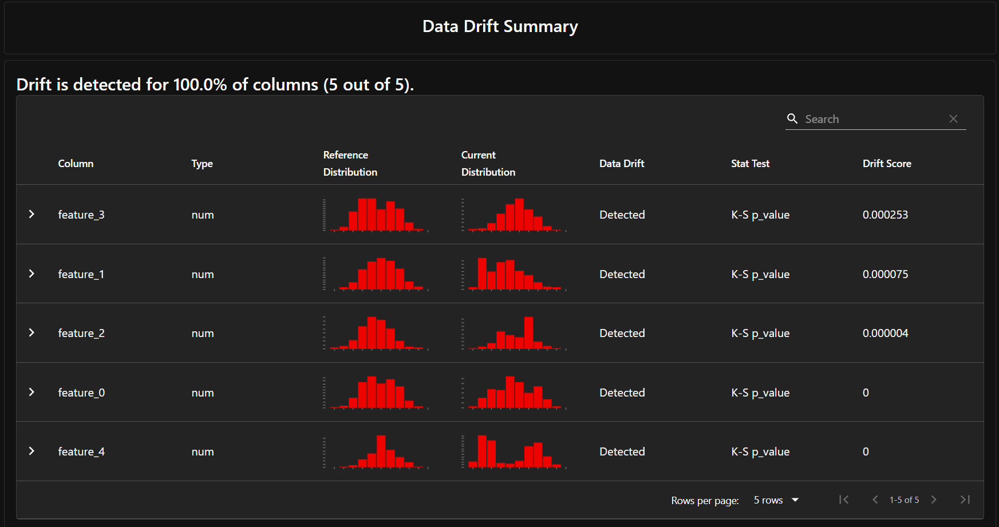

# Laboratorium 07: Monitoring modelu ML w produkcji

## Zadanie 2: Wykrywanie Data Driftu

Używając biblioteki Evidently AI, wygenerowano raport analizujący `Data Drift` pomiędzy zbiorem referencyjnym a produkcyjnym.

Wszystkie kolumny uległy driftowi.

## Zadanie 3: Analiza jakości predykcji

Przeprowadzono analizę jakości modelu dla problemu klasyfikacji porównując metryki na danych historycznych i produkcyjnych.

**Wyniki jakości (na podstawie pliku `classification_quality_report.html`):**
* **Metryki na zbiorze referencyjnym (historycznym):**
    * Accuracy: 1.0
    * Precision: 1.0
    * Recall: 1.0
    * F1: 1.0
* **Metryki na zbiorze produkcyjnym:**
    * Accuracy: 0.757
    * Precision: 0.752
    * Recall: 0.767
    * F1: 0.759

**Wnioski i ocena:**

* **Czy jakość spadła w sposób znaczący?** 
* Tak, jakość spadła w sposób bardzo znaczący. Metryki na zbiorze referencyjnym wynoszą 1.0, natomiast na danych produkcyjnych spadły do poziomu około 0.75-0.76. Różnica bliska 25 punktów procentowych dla dokładności (Accuracy) wskazuje, że model dużo gorzej radzi sobie z nowymi danymi.

* **Sugerowane działania:** 
* Retraining modelu - warto połączyć dotychczasowe dane z nowym zbiorem produkcyjnym. Przed ponownym treningiem należałoby również zadbać o hiperparametry modelu RandomForestClassifier (np. ograniczenie głębokości drzew – max_depth), aby zapobiec ponownemu przeuczeniu. Warto również zerknąć w plik data_drift_report.html, aby zidentyfikować, na których cechach rozkłady danych zmieniły się najbardziej.