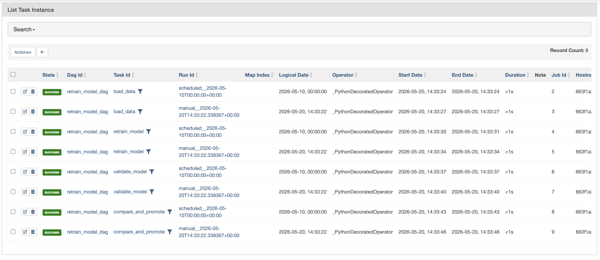
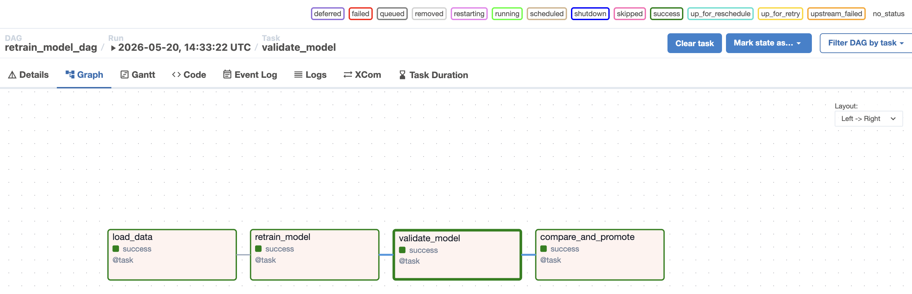

# Laboratorium 08: Dynamiczne re-trenowanie modeli ML

Pipeline w Apache Airflow (2.10.4, Python 3.11) uruchamiany w Dockerze — omija problemy z `SIGSEGV` przy lokalnym Airflow na macOS.


## Uruchomienie

```bash
cd Lab08

# Dane wejściowe (na hoście; potrzebne: pandas, scikit-learn)
python3 data/generate_data.py

# Uid hosta — zapis modeli do ./models z kontenera (macOS/Linux)
export AIRFLOW_UID=$(id -u)

docker compose up
```

UI: `http://localhost:8080` — login: `admin` / `admin`

Zatrzymanie: `Ctrl+C`, potem opcjonalnie `docker compose down`.

## Wyniki




