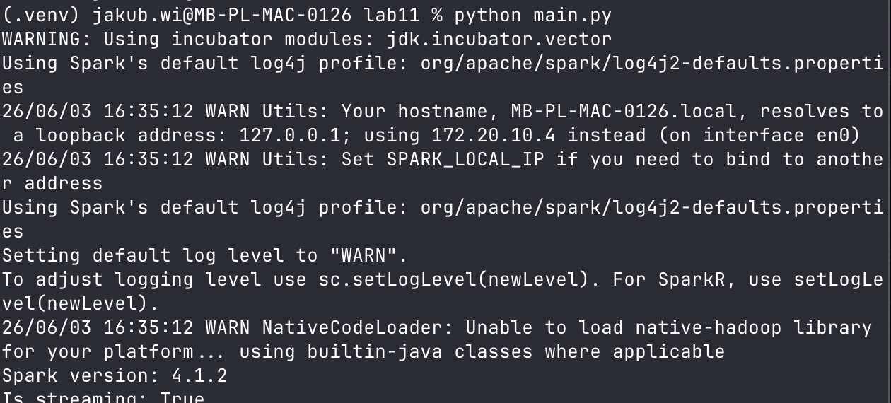
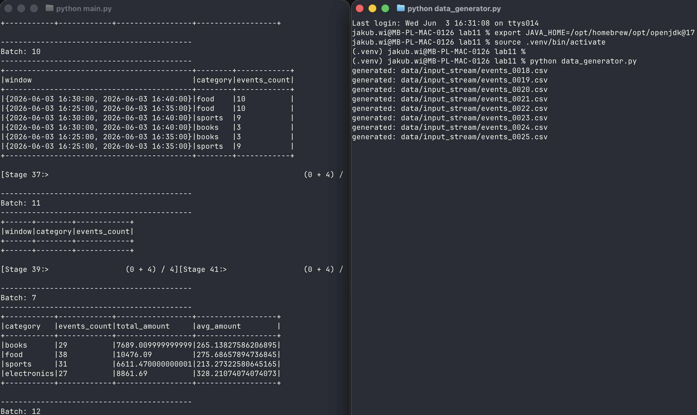
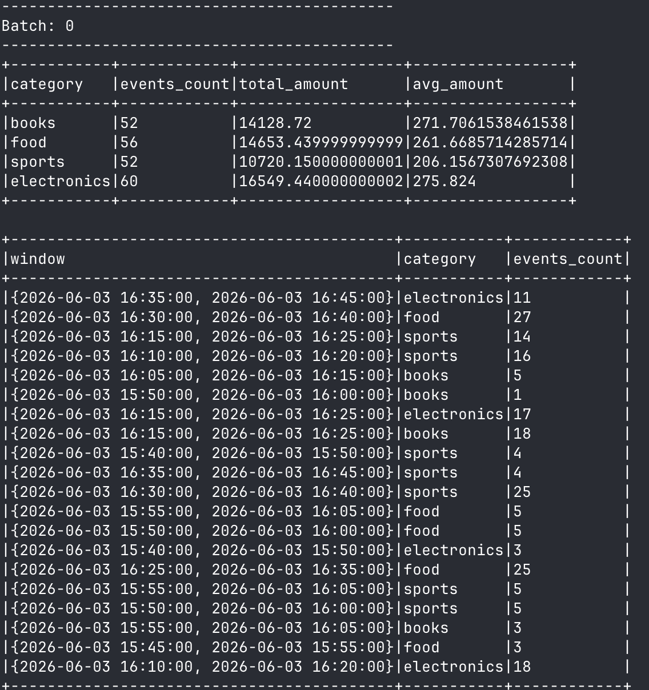
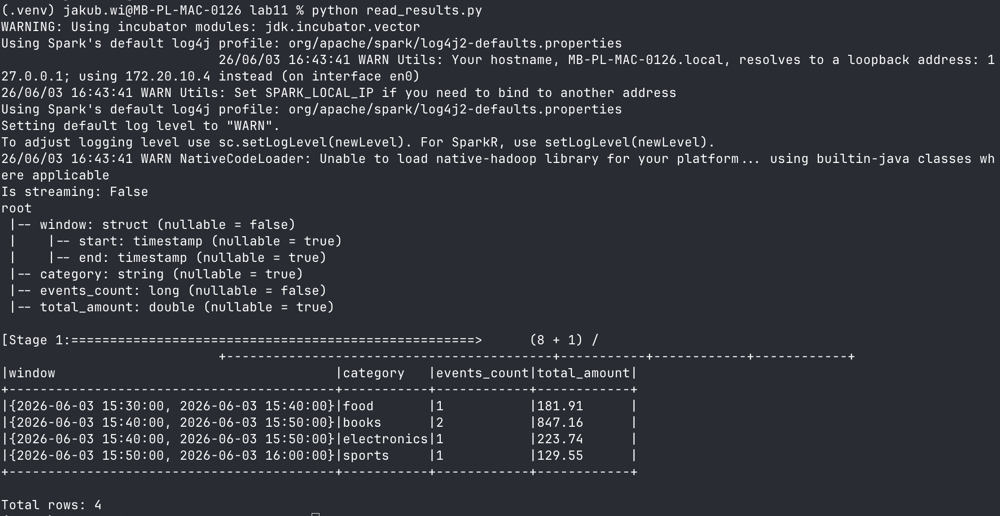

# LAB11 — Apache Spark Structured Streaming

## Uruchomienie projektu

Wymagana Java 17+ i Python 3.11.

```bash
python3.11 -m venv .venv
.venv/bin/pip install -r requirements.txt

# terminal 1 — aplikacja strumieniowa
.venv/bin/python main.py

# terminal 2 — generator danych (15 plikow co 4 s)
.venv/bin/python data_generator.py 15 4

# po zatrzymaniu aplikacji — odczyt wynikow jako batch
.venv/bin/python read_results.py
```

## Zadanie 1

- Wersja Spark/PySpark: **4.1.2**
- Aplikacja uruchamia lokalną sesję Spark (`master("local[*]")`) — sposób uruchomienia powyżej.



## Zadanie 2

DataFrame jest strumieniowy — `df.isStreaming` zwraca `True`. Schemat:

```
root
 |-- event_time: timestamp (nullable = true)
 |-- user_id: string (nullable = true)
 |-- category: string (nullable = true)
 |-- amount: double (nullable = true)
 |-- status: string (nullable = true)
```

## Zadanie 3

Pliki dodawane przez generator w trakcie działania aplikacji są przetwarzane jako kolejne mikro-batche bez restartu — wartości w kolejnych batchach rosną:



## Zadanie 4

**Czas zdarzenia (event time)** to moment, w którym zdarzenie faktycznie wystąpiło (kolumna `event_time` w danych). **Czas przetwarzania (processing time)** to moment, w którym Spark odebrał i przetworzył rekord. Mogą się znacznie różnić, gdy dane docierają z opóźnieniem.

**Watermarking** określa, jak długo Spark czeka na dane opóźnione. Przy watermarku 10 minut rekord starszy niż `max(event_time) - 10 min` jest odrzucany, a stan zamkniętych okien jest usuwany z pamięci. W testach zdarzenia opóźnione o 15–40 minut nie trafiały już do zamkniętych okien — bez watermarku Spark musiałby trzymać stan wszystkich okien w nieskończoność.

**Okna stałe vs przesuwające:** okno stałe (tumbling, `window(col, "10 minutes")`) dzieli czas na rozłączne przedziały — każde zdarzenie należy do dokładnie jednego okna. Okno przesuwające (sliding, `window(col, "10 minutes", "5 minutes")`) generuje nakładające się przedziały co 5 minut — to samo zdarzenie liczone jest w dwóch oknach. Widać to w wynikach: dla sliding to samo zdarzenie pojawia się w dwóch sąsiednich oknach, a suma `events_count` jest ~2x większa niż dla tumbling:



## Zadanie 5

Po zatrzymaniu i ponownym uruchomieniu aplikacji query kontynuowało od ostatniego zatwierdzonego batcha i przetwarzało wyłącznie nowo dodane pliki — stare dane nie zostały przetworzone ponownie.

Zapisane pliki Parquet wczytano jako zwykły batch DataFrame (`read_results.py`, `isStreaming = False`). Wyniki zgadzają się z konsolą, z jedną różnicą: w trybie `append` do plików trafiają tylko okna zamknięte (po przekroczeniu watermarku), a konsola pokazuje też okna wciąż otwarte.



### Batch vs streaming

- **Batch** — przetwarza skończony, znany z góry zbiór danych jednorazowo; wynik jest kompletny po zakończeniu zadania.
- **Streaming** — przetwarza dane napływające w sposób ciągły, w mikro-batchach; wynik jest aktualizowany przyrostowo, a zapytanie działa bezterminowo.

### Tryby wyjścia

- **`append`** — emituje tylko nowe, finalne wiersze (przy agregacjach wymaga watermarku); jedyny tryb dla sinków plikowych.
- **`update`** — emituje tylko wiersze zmienione w danym batchu.
- **`complete`** — emituje całą tabelę wynikową przy każdym batchu; wymaga trzymania pełnego stanu agregacji.

### Checkpointing vs zwykły zapis plików

Zwykły zapis plików to tylko wyniki. Checkpoint przechowuje **stan zapytania**: offsety przetworzonych źródeł (które pliki już wczytano), stan agregacji i watermark. Dzięki temu po awarii lub restarcie Spark wznawia dokładnie od miejsca przerwania, bez duplikowania danych — sam zapis wyników tego nie gwarantuje.
