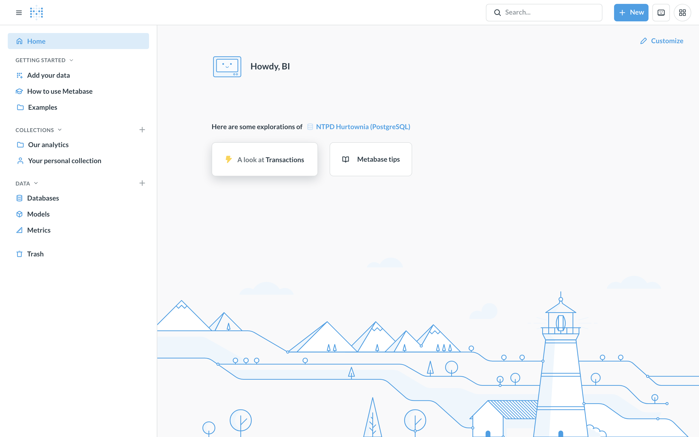
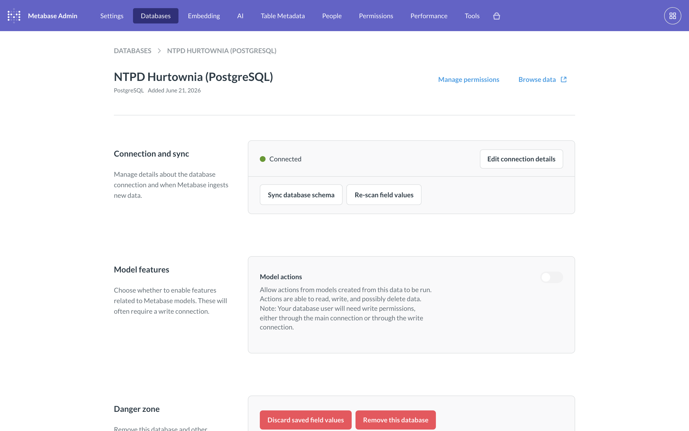
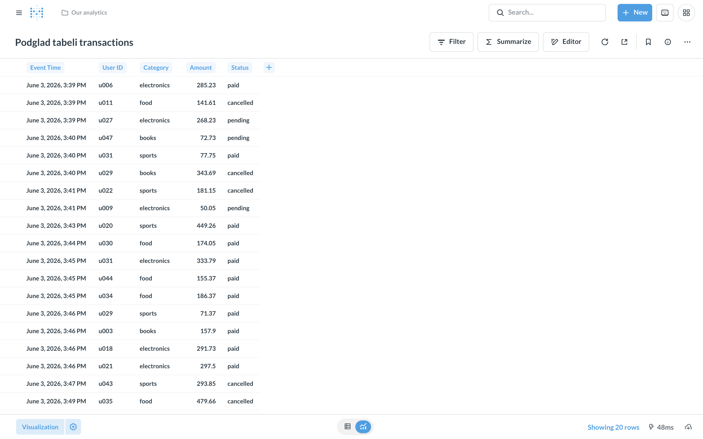
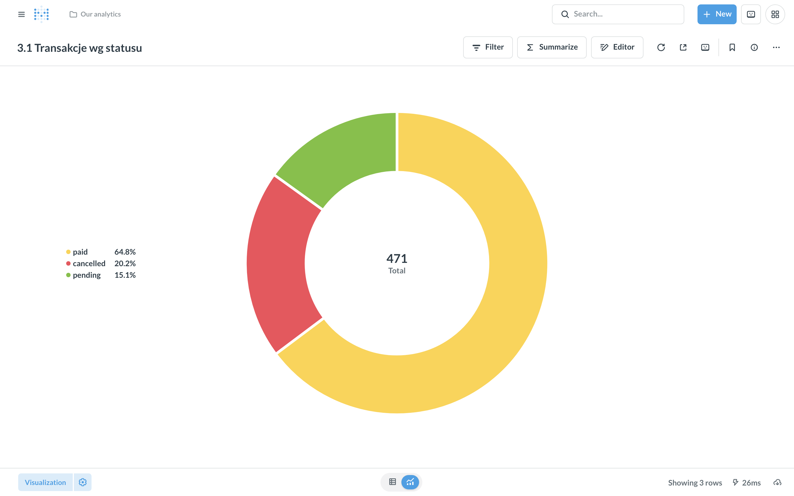
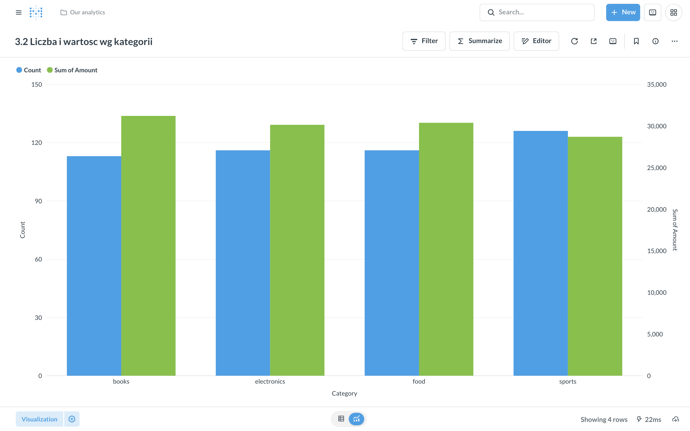
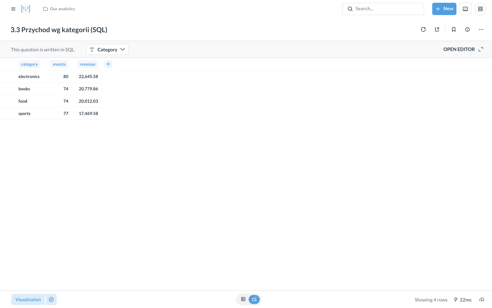
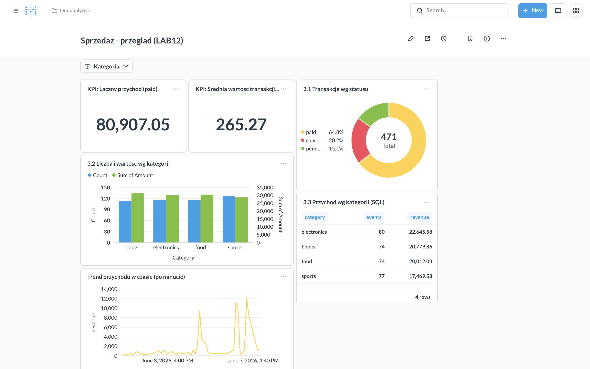
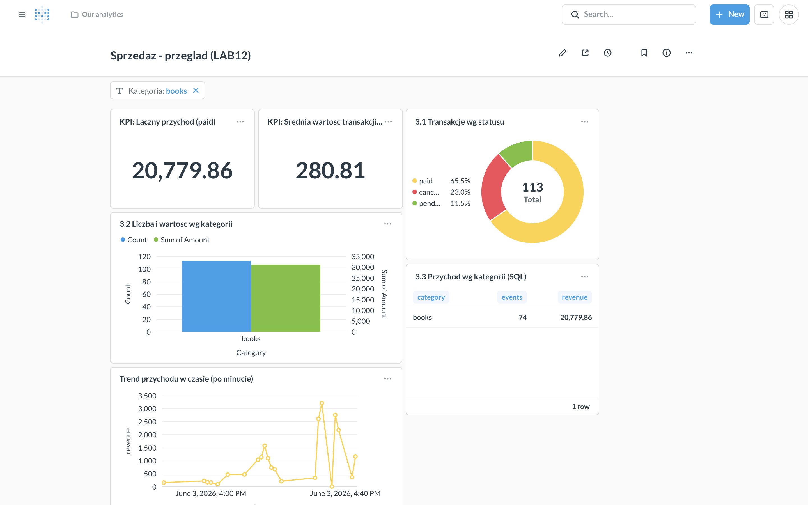
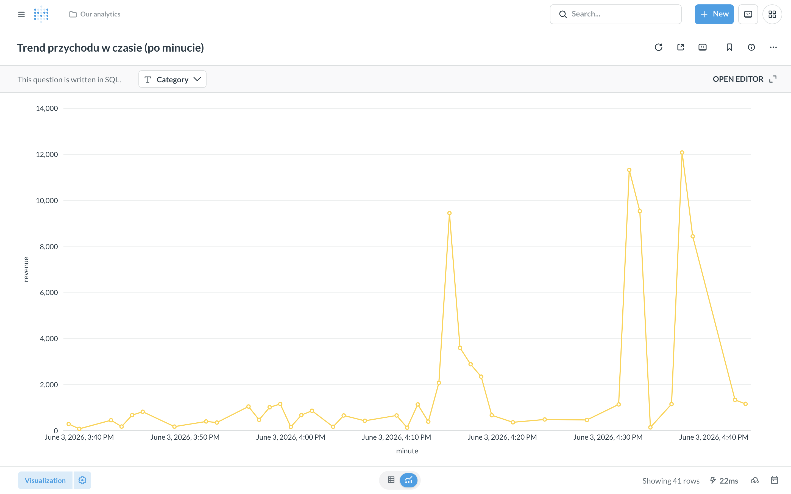
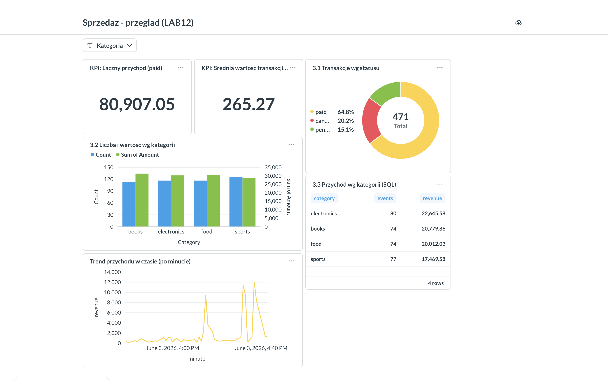

# LAB12 — Business Intelligence w Metabase

Wizualizacja i analiza danych w narzędziu BI (Metabase) na bazie analitycznej
PostgreSQL. Dane wejściowe pochodzą z **LAB11** (surowe zdarzenia ze strumienia
Spark), skonsolidowane do jednego pliku `data/transactions.csv` o polach:
`event_time, user_id, category, amount, status` (471 transakcji).

## Uruchomienie projektu

Wymagany Docker + Docker Compose oraz Python 3.11.

```bash
# 1. baza analityczna (PostgreSQL) + Metabase
docker compose up -d

# 2. srodowisko Python i zaladowanie danych do bazy
python3.11 -m venv .venv
.venv/bin/pip install -r requirements.txt
.venv/bin/python load_data.py

# 3. Metabase w przegladarce
#    http://localhost:3000  -> utworz konto administratora
```

Konfigurację Metabase (konto admina, połączenie z bazą, 6 pytań, dashboard z filtrem,
publiczny link) można też odtworzyć automatycznie przez REST API:

```bash
.venv/bin/python setup_metabase.py     # wymaga: pip install requests
```

Skrypt zapisuje `mb_state.json` z identyfikatorami utworzonych obiektów. Konto admina:
`admin@ntpd.local` / `Ntpd!2026Bi`. Zrzuty ekranu w `screenshots/` wygenerowano headless
przeglądarką (Playwright) na realnie postawionym środowisku.

Logi po uruchomieniu `load_data.py`:

```
Zaladowano wierszy: 471 (w bazie: 471)
Zakres czasu: 2026-06-03 15:39:26 -> 2026-06-03 16:43:08
Kategorie: books, electronics, food, sports
```

Zatrzymanie środowiska: `docker compose down` (z usunięciem danych: `docker compose down -v`).

---

## Zadanie 1 — Przygotowanie środowiska

Środowisko uruchamiane jednym poleceniem `docker compose up -d` (plik
[`docker-compose.yml`](docker-compose.yml)). Postawione kontenery:

| Usługa | Obraz | Wersja | Port |
|--------|-------|--------|------|
| Hurtownia danych | `postgres:16` | PostgreSQL **16.14** (Debian) | `5432` |
| Narzędzie BI | `metabase/metabase:latest` | Metabase **v0.62.2.7** | `3000` |

Digesty użytych obrazów (powtarzalność):

```
postgres@sha256:081f1bc7bd5e143dbb6e487b710bbc27712cdcfaced4c071b8e47349aa1b4171
metabase@sha256:e3ee7f6ce6ba4278cc375fd3e0f3f9f66c84f8359496b6dbe0a59152555add27
```

Postgres ma zdefiniowany `healthcheck` (`pg_isready`), a Metabase startuje dopiero,
gdy baza jest zdrowa (`depends_on: condition: service_healthy`) — dzięki temu nie
ma wyścigu przy starcie. Interfejs Metabase potwierdza gotowość (`/api/health`
zwraca `{"status":"ok"}`).

Po wejściu na `http://localhost:3000` utworzono konto administratora.



## Zadanie 2 — Załadowanie danych do bazy analitycznej

Dane (`data/transactions.csv`) ładuje skrypt [`load_data.py`](load_data.py)
przez SQLAlchemy + psycopg2 do tabeli `transactions` (`if_exists="replace"`).

W Metabase dodano połączenie do bazy:

| Parametr | Wartość |
|----------|---------|
| Typ | PostgreSQL |
| Host | `postgres` (sieć Dockera) lub `localhost` |
| Port | `5432` |
| Baza | `ntpd` |
| Użytkownik / hasło | `bi` / `bi` |

> Z poziomu kontenera Metabase host to `postgres` (nazwa usługi w sieci Compose),
> a nie `localhost` — `localhost` wewnątrz kontenera wskazywałby na sam kontener Metabase.

Po dodaniu połączenia tabela `transactions` jest widoczna i można przeglądać jej zawartość.





## Zadanie 3 — Pytania (questions) i wykresy

Utworzono trzy pytania:

**3.1. Kreator wizualny (bez SQL) — liczba transakcji wg statusu → wykres kołowy.**
Notebook editor: `Summarize → Count`, `Group by → status`. Wizualizacja kołowa,
bo pokazujemy **udział** kilku rozłącznych kategorii w całości (paid/cancelled/pending).
Wynik na danych: `paid 305, cancelled 95, pending 71`.



**3.2. Agregacja wg kategorii — liczba zdarzeń i suma wartości → wykres słupkowy.**
Notebook editor: `Summarize → Count` oraz `Sum of amount`, `Group by → category`.
Słupkowy, bo **porównujemy wartości między kategoriami** — długość słupka jest łatwa
do porównania wzrokowego.



**3.3. Pytanie zapisane jako SQL — przychód wg kategorii (tylko opłacone) → tabela / słupki.**

```sql
SELECT category,
       COUNT(*)              AS events,
       ROUND(SUM(amount), 2) AS revenue
FROM transactions
WHERE status = 'paid'
GROUP BY category
ORDER BY revenue DESC;
```

Wynik na danych:

| category | events | revenue |
|----------|-------:|--------:|
| electronics | 80 | 22645.58 |
| books | 74 | 20779.86 |
| food | 74 | 20012.03 |
| sports | 77 | 17469.58 |

Typ wizualizacji: tabela (dokładne liczby) lub słupkowy (ranking) — oba pasują, bo
to zestawienie metryk dla kilku kategorii.



**Dlaczego takie typy wykresów:** kołowy → udział części w całości (statusy);
słupkowy → porównanie wartości między kategoriami (ranking przychodu/liczby zdarzeń);
liniowy → zmiana wartości w czasie (trend, zob. Zad. 4); tabela → dokładne liczby,
gdy ważna jest precyzja, a nie kształt.

## Zadanie 4 — Dashboard

Dashboard **„Sprzedaż — przegląd”** z 5 kartami, ułożony od KPI na górze do
szczegółów niżej (zgodnie ze wskazówką):

1. KPI: łączny przychód (paid) — **80 907,05**
2. KPI: średnia wartość transakcji (paid) — **265,27**
3. Przychód wg kategorii — wykres słupkowy (pytanie 3.3)
4. Udział statusów — wykres kołowy (pytanie 3.1)
5. **Trend przychodu w czasie** — wykres liniowy (zob. niżej)

**Filtr dashboardu (parametr):** dodano filtr `category` (oraz opcjonalnie `status`),
podpięty do wszystkich kart (kart MBQL przez kolumnę `category`, kart SQL przez
field-filter `{{category_filter}}`). Zmiana filtra aktualizuje jednocześnie wszystkie
karty — potwierdza to interaktywność dashboardu.



Po ustawieniu filtra `Kategoria = books` wszystkie karty przeliczają się jednocześnie
(KPI przychodu spada do 20 779,86, słupki/tabela/wykres kołowy pokazują tylko `books`):



**Analiza trendu w czasie (na ocenę 5).** Dodano parametr czasu i wykres liniowy
przychodu. Dane LAB11 obejmują tylko ~1 godzinę jednego dnia
(`2026-06-03 15:39 → 16:43`), więc grupowanie po dniu/tygodniu dałoby pojedynczy
słupek — dlatego trend pokazujemy **z grupowaniem po minucie**, co dla tego zbioru
jest właściwą granulacją:

```sql
SELECT date_trunc('minute', event_time) AS minute,
       ROUND(SUM(amount), 2)            AS revenue,
       COUNT(*)                         AS tx
FROM transactions
WHERE status = 'paid'
GROUP BY 1
ORDER BY 1;
```

W Metabase to samo można uzyskać kreatorem: `Sum of amount`, `Group by → event_time:
Minute`. (Dla danych obejmujących wiele dni wystarczy zmienić granulację na `Day`/`Week`.)



## Zadanie 5 — Wskaźniki, analiza i udostępnianie

### Wskaźniki biznesowe (KPI)

Obliczone na załadowanych danych (471 transakcji):

| KPI | Definicja | Wartość |
|-----|-----------|--------:|
| Łączny przychód (opłacone) | `SUM(amount) WHERE status='paid'` | 80 907,05 |
| Średnia wartość transakcji (opłacone) | `AVG(amount) WHERE status='paid'` | 265,27 |
| Udział transakcji opłaconych | `paid / wszystkie` | 64,8 % |

```sql
SELECT ROUND(SUM(amount) FILTER (WHERE status='paid')::numeric, 2)            AS total_revenue_paid,
       ROUND(AVG(amount) FILTER (WHERE status='paid')::numeric, 2)            AS avg_ticket_paid,
       ROUND(100.0 * COUNT(*) FILTER (WHERE status='paid') / COUNT(*), 1)     AS paid_share_pct
FROM transactions;
```

### Pytanie biznesowe: które kategorie generują największy przychód?

Z agregacji (Zad. 3.3): przychód jest **wyrównany między kategoriami**, ale liderem
jest **electronics (22 645,58)**, mimo że nie ma najwięcej transakcji — decyduje
wyższa średnia wartość koszyka. Najniższy przychód ma **sports (17 469,58)** przy
porównywalnej liczbie zdarzeń, czyli niższa wartość pojedynczej transakcji. Wniosek:
wzrost przychodu w sports należałoby szukać raczej w podniesieniu wartości koszyka
niż liczby zamówień.

### Udostępnianie wyników

- **Kolekcja** — pytania zapisano we wspólnej kolekcji (np. „LAB12 / Sprzedaż”).
- **Eksport CSV** — wynik pytania można pobrać przez `Download → .csv`.
- **Dashboard publiczny / subskrypcja** — w `Admin → Public sharing` można włączyć
  publiczny link do dashboardu albo skonfigurować subskrypcję e-mail.



### Różnice pojęciowe

**Przetwarzanie danych a warstwa BI.** Przetwarzanie (ETL/Spark z LAB09–LAB11) to
czyszczenie, łączenie i agregacja surowych danych — przygotowanie *poprawnych* danych.
Warstwa BI nie zmienia danych, tylko czyni je *zrozumiałymi*: pytania, wykresy,
dashboardy i wskaźniki dla odbiorcy biznesowego. Pierwsza odpowiada na „jak
przekształcić dane”, druga na „co te dane mówią”.

**Dashboard a raport statyczny.** Dashboard jest interaktywny i żywy — filtry,
drill-down, dane odświeżane z bazy przy każdym wejściu. Raport statyczny (np. PDF) to
zamrożony stan na moment wygenerowania, bez interakcji; dobry do archiwum/wysyłki,
ale szybko się dezaktualizuje.

**Zapytanie ad-hoc a zdefiniowany wskaźnik.** Ad-hoc to jednorazowe pytanie zadane
„tu i teraz”, często nigdzie niezapisane. Zdefiniowany wskaźnik (metric/KPI) to
uzgodniona, nazwana i wielokrotnie używana definicja (np. „przychód = SUM(amount)
WHERE status='paid'”) — gwarantuje, że wszyscy liczą to samo tak samo.

### Metabase a inne narzędzie BI (na ocenę 5)

| Kryterium | Metabase | Apache Superset | Power BI | Grafana |
|-----------|----------|-----------------|----------|---------|
| Próg wejścia | bardzo niski (kreator bez SQL) | średni | niski–średni | średni |
| Mocna strona | szybkie self-service BI dla zespołu | bogate wykresy + SQL Lab, open-source | ekosystem MS, modelowanie DAX | metryki/monitoring time-series |
| Licencja | open-source (+ wersja płatna) | open-source (Apache) | komercyjna (MS) | open-source (+ płatna) |
| Najlepsze do | analiz biznesowych, dashboardów ad-hoc | zaawansowanych analiz na hurtowni | korporacji w ekosystemie Microsoft | dashboardów operacyjnych/DevOps |

**Kiedy co jest wygodniejsze:** **Metabase** — gdy chcemy szybko dać nietechnicznemu
zespołowi self-service BI nad bazą SQL przy minimum konfiguracji (jak w tym laboratorium).
**Superset** — gdy potrzebujemy szerszej biblioteki wykresów i pełnej kontroli SQL,
zostając w open-source. **Power BI** — gdy organizacja działa w ekosystemie Microsoft
i potrzebuje modelowania danych (DAX) oraz integracji z Office. **Grafana** — gdy dane
są szeregami czasowymi z metryk/monitoringu, a nie klasycznymi transakcjami biznesowymi.

---

## Struktura repozytorium

```
Lab12/
├── docker-compose.yml      # PostgreSQL 16 + Metabase
├── load_data.py            # zaladowanie data/transactions.csv -> tabela transactions
├── setup_metabase.py       # (opcjonalnie) konfiguracja Metabase przez REST API
├── requirements.txt        # pandas, SQLAlchemy, psycopg2-binary (+ requests, playwright)
├── data/
│   └── transactions.csv    # 471 transakcji z LAB11 (event_time,user_id,category,amount,status)
├── screenshots/            # zrzuty ekranu z Metabase (zob. powyzej)
└── README.md               # sprawozdanie (ten plik)
```
