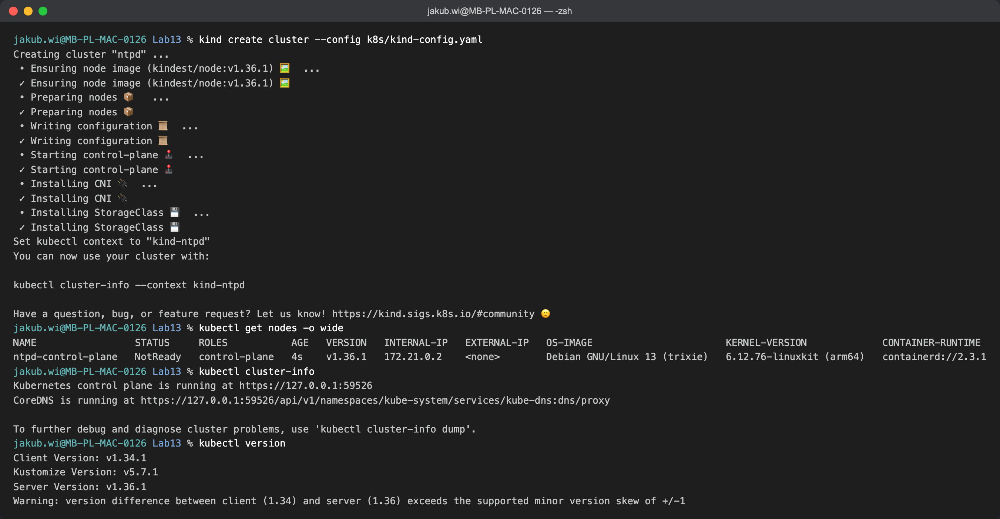
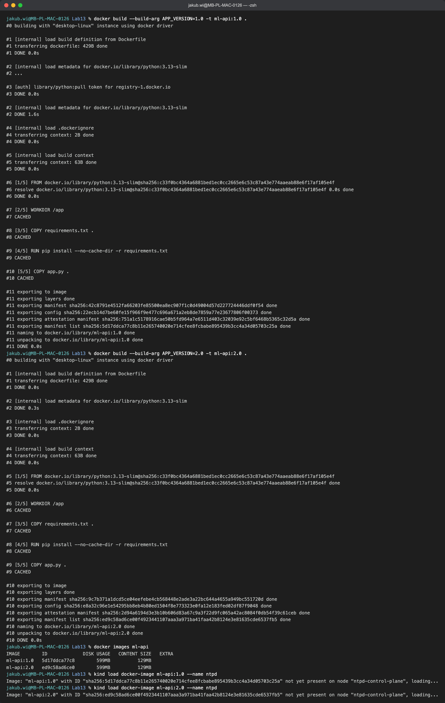
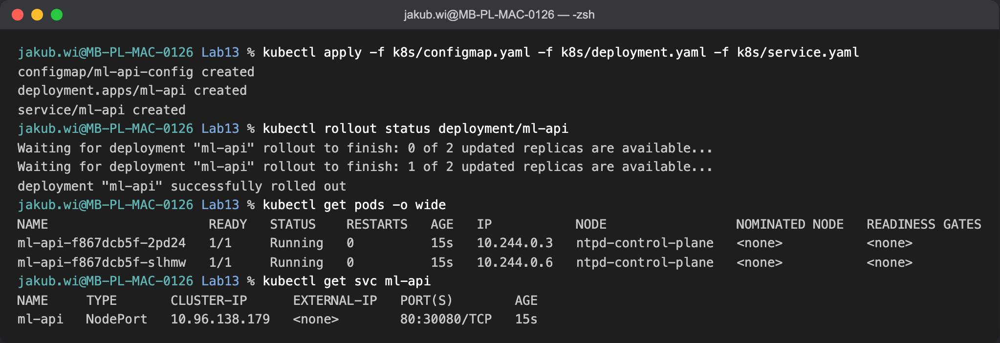
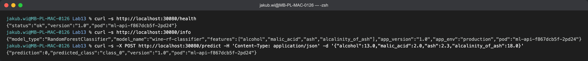
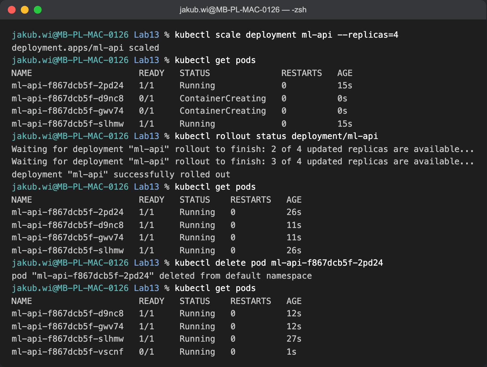
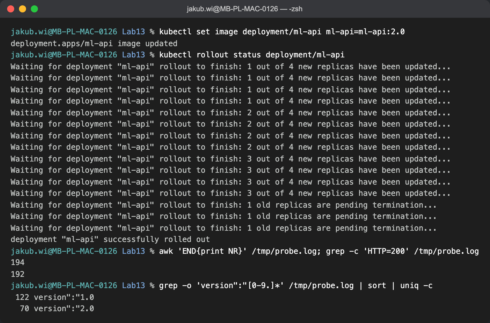
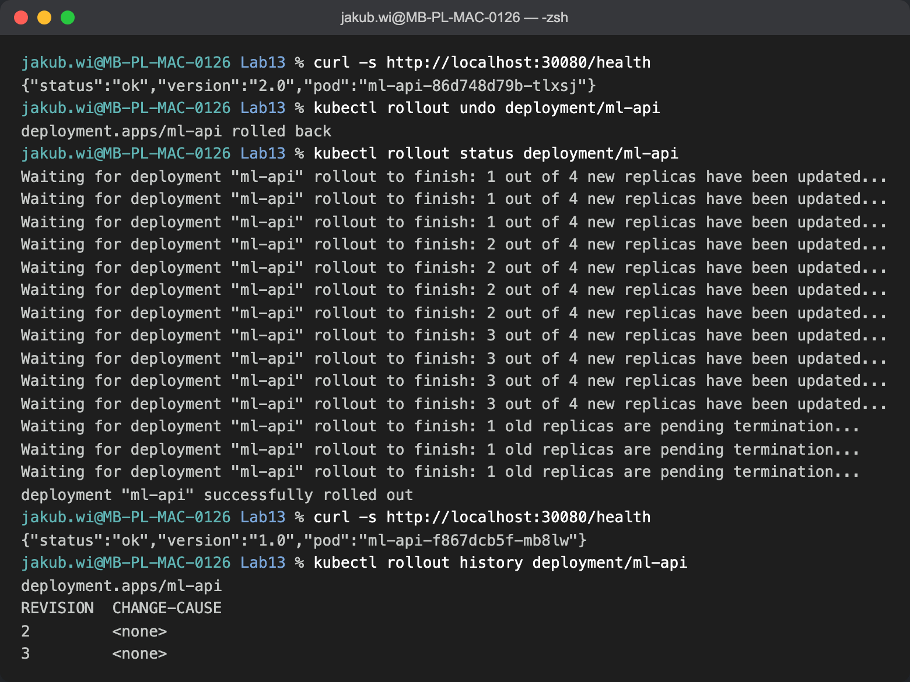
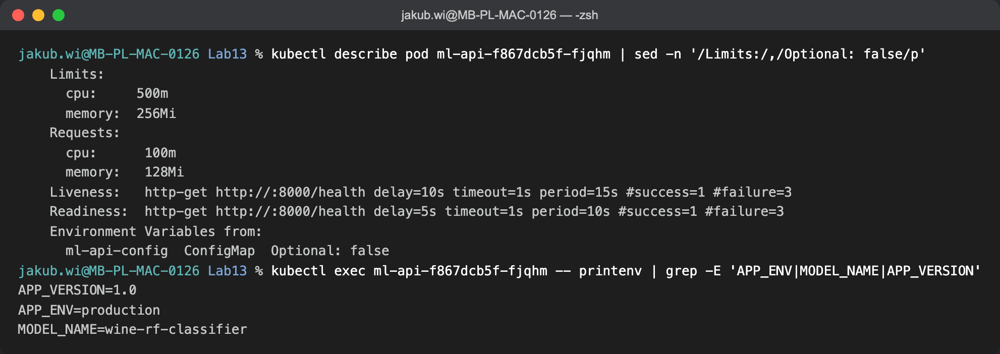
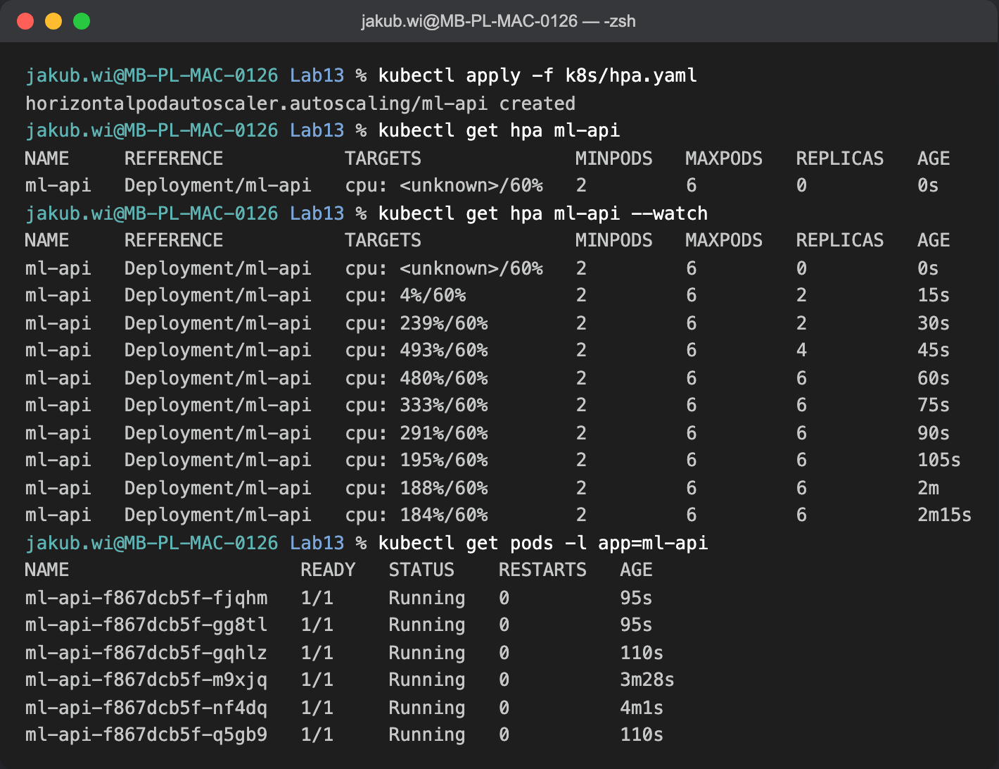

# LAB13 — Orkiestracja kontenerów w Kubernetes

Wdrożenie skonteneryzowanego API modelu ML (klasyfikator wina z LAB04, FastAPI:
`/predict`, `/health`, `/info`) na lokalnym klastrze Kubernetes: Deployment + Service,
skalowanie, samonaprawianie, rolling update i rollback, sondy zdrowia, limity zasobów,
ConfigMap oraz autoskalowanie poziome (HPA).

## Struktura

```
Lab13/
├── app.py                  # API FastAPI (model RandomForest, /predict, /health, /info)
├── Dockerfile              # obraz aplikacji (ARG APP_VERSION -> v1.0 / v2.0)
├── requirements.txt
└── k8s/
    ├── kind-config.yaml    # klaster kind z mapowaniem NodePort 30080 na host
    ├── configmap.yaml      # APP_ENV, MODEL_NAME (wstrzykiwane jako env)
    ├── deployment.yaml     # Deployment: repliki, sondy, limity, envFrom ConfigMap
    ├── service.yaml        # Service NodePort (30080)
    └── hpa.yaml            # HorizontalPodAutoscaler (CPU 60%, 2–6 replik)
```

## Uruchomienie

```bash
# 1. klaster (kind) + sprawdzenie
kind create cluster --config k8s/kind-config.yaml
kubectl get nodes

# 2. obraz aplikacji i zaladowanie do klastra
docker build --build-arg APP_VERSION=1.0 -t ml-api:1.0 .
docker build --build-arg APP_VERSION=2.0 -t ml-api:2.0 .   # wersja do rolling update
kind load docker-image ml-api:1.0 --name ntpd
kind load docker-image ml-api:2.0 --name ntpd

# 3. wdrozenie
kubectl apply -f k8s/configmap.yaml -f k8s/deployment.yaml -f k8s/service.yaml
kubectl rollout status deployment/ml-api

# 4. test (NodePort zmapowany na localhost:30080)
curl http://localhost:30080/health
curl -X POST http://localhost:30080/predict \
  -H "Content-Type: application/json" \
  -d '{"alcohol":13.0,"malic_acid":2.0,"ash":2.3,"alcalinity_of_ash":18.0}'

# 5. (ocena 5) autoskalowanie — wymaga metrics-server
kubectl apply -f https://github.com/kubernetes-sigs/metrics-server/releases/latest/download/components.yaml
kubectl patch deployment metrics-server -n kube-system --type='json' \
  -p='[{"op":"add","path":"/spec/template/spec/containers/0/args/-","value":"--kubelet-insecure-tls"}]'
kubectl apply -f k8s/hpa.yaml
```

---

## Zad. 1 — środowisko (wersja Kubernetes i sposób uruchomienia)

- Klaster lokalny: **kind v0.32.0** na Dockerze; `kubectl` **v1.34.1**.
- Wersja Kubernetes (serwer): **v1.36.1** (obraz węzła `kindest/node:v1.36.1`).
- Uruchomienie: `kind create cluster --config k8s/kind-config.yaml` — pojedynczy węzeł
  `control-plane`; w konfiguracji zmapowano NodePort `30080` na port hosta, dzięki czemu
  usługa jest osiągalna pod `http://localhost:30080`.



## Zad. 2 — obraz kontenera (nazwa i tag)

- Obraz: **`ml-api:1.0`** oraz **`ml-api:2.0`** (ta sama aplikacja, różna wartość
  `APP_VERSION` wbudowana przez `--build-arg`, by zademonstrować aktualizację kroczącą).
- Obrazy załadowano lokalnie do klastra (`kind load docker-image`), więc nie są pobierane
  z zewnętrznego rejestru (`imagePullPolicy: IfNotPresent`).



## Zad. 3 — Deployment, Service i test endpointu

Deployment uruchamia 2 repliki, Service typu `NodePort` udostępnia je w klastrze i na
zewnątrz. Endpoint predykcji działa, a odpowiedzi zawierają nazwę poda — widać, że
ruch jest rozkładany między repliki.





## Zad. 4 — co działo się z podami podczas skalowania i aktualizacji

**Skalowanie i samonaprawianie.** Po `kubectl scale --replicas=4` kontroler ReplicaSet
utworzył 2 dodatkowe pody (najpierw `0/1`, dopóki nie przeszły sondy readiness, potem
`1/1`). Po ręcznym usunięciu jednego poda klaster **natychmiast** (w ~1 s) utworzył nową
replikę, utrzymując zadaną liczbę 4 — to mechanizm samonaprawiania (deklarowany stan
pożądany ≠ stan bieżący → kontroler dąży do zgodności).



**Aktualizacja krocząca i rollback.** `kubectl set image ... ml-api:2.0` uruchomił
rolling update: nowe pody (v2.0) były tworzone i dopiero po przejściu readiness stare
pody (v1.0) były usuwane — kolejno 1→2→3→4 nowych, na końcu wygaszenie starych.
Dzięki `maxUnavailable: 0` liczba dostępnych podów nigdy nie spadła poniżej żądanej.

Aktualizację wykonano przy **stałej dostępności API** (ocena 5): równolegle sonda biła
w `/health` co 0,2 s. Na **194** żądania **192** zwróciły `HTTP 200`; dwa (`HTTP=000`)
to chwilowe resety połączenia TCP na NodePort w momencie przełączania endpointów — nie
przestój aplikacji (Deployment przez cały czas miał komplet gotowych podów). W odpowiedziach
widać płynne przejście: 122 z wersji `1.0`, następnie 70 z wersji `2.0`.



`kubectl rollout undo` przywrócił wersję `1.0` (analogiczny przebieg kroczący w drugą
stronę); `rollout history` pokazuje kolejne rewizje.



## Zad. 5 — konfiguracja, sondy, limity oraz wymagane różnice

Pody mają sondy `readiness`/`liveness` na `/health`, żądania i limity CPU/pamięci oraz
konfigurację wstrzykiwaną z `ConfigMap` jako zmienne środowiskowe (`APP_ENV`, `MODEL_NAME`).



**Autoskalowanie poziome (ocena 5).** Po włączeniu `metrics-server` i utworzeniu HPA
(CPU 60%, 2–6 replik) wygenerowano obciążenie (40 równoległych żądań `/predict`).
Zużycie CPU wzrosło do ~490%/60%, a HPA przeskalował wdrożenie **2 → 4 → 6** replik w
ciągu ~1 min i utrzymał 6 podów pod obciążeniem; po jego zdjęciu wraca do 2 (okno
stabilizacji ~5 min).



### Różnice pojęciowe

**Pojedynczy kontener Docker a wdrożenie w Kubernetes.** Pojedynczy kontener to jeden
proces na jednym hoście — gdy padnie, nie wstaje sam, nie skaluje się i nie ma
load-balancingu. Kubernetes zarządza *zbiorem* kontenerów (podów) w sposób deklaratywny:
utrzymuje zadaną liczbę replik, sam odtwarza padnięte pody (samonaprawianie), rozkłada
ruch przez Service, umożliwia skalowanie, rolling update i rollback bez przerw.

**Podejście deklaratywne a imperatywne.** Deklaratywne (manifesty YAML + `kubectl apply`)
opisuje *stan pożądany* — Kubernetes sam doprowadza klaster do tego stanu; konfiguracja
jest wersjonowalna i powtarzalna (GitOps). Imperatywne (`kubectl scale`, `kubectl set
image`, `kubectl delete` ad-hoc) to pojedyncze komendy *„zrób to teraz"* — szybkie do
eksperymentów, ale ulotne i trudne do odtworzenia. W tym labie manifesty są deklaratywne,
a komendy z Zad. 4 imperatywne.

**Sonda `readiness` a `liveness`.** `readiness` decyduje, czy pod jest **gotowy
przyjmować ruch** — dopóki nie przejdzie, Service nie kieruje do niego żądań (kluczowe
przy starcie i podczas rolling update). `liveness` decyduje, czy kontener **żyje** —
po jej niepowodzeniu Kubernetes **restartuje** kontener. Czyli: readiness chroni
użytkownika przed trafieniem do nieprzygotowanego poda, liveness leczy zawieszony proces.
